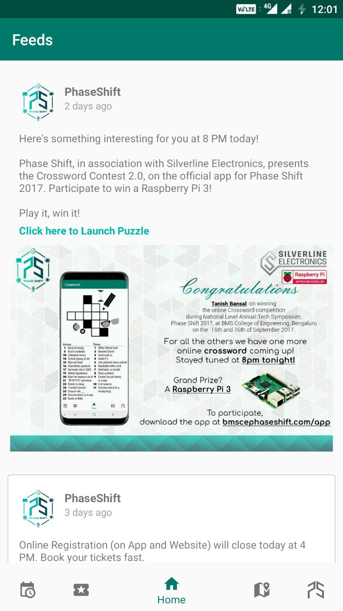
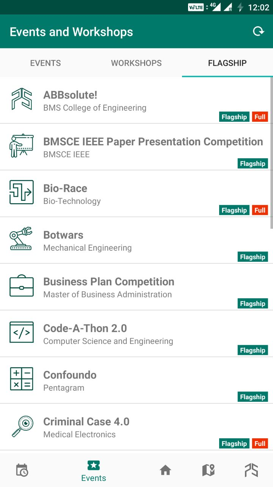
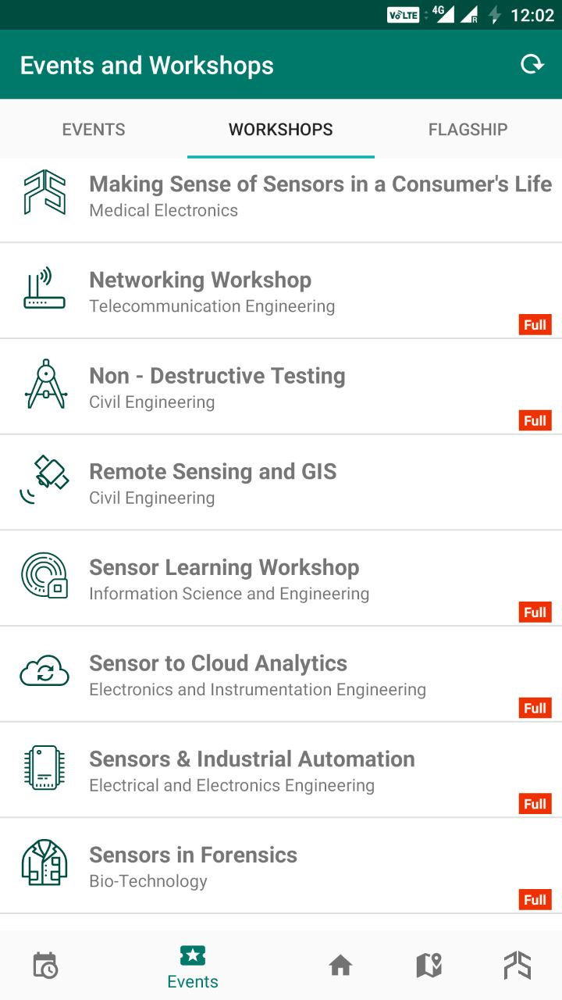
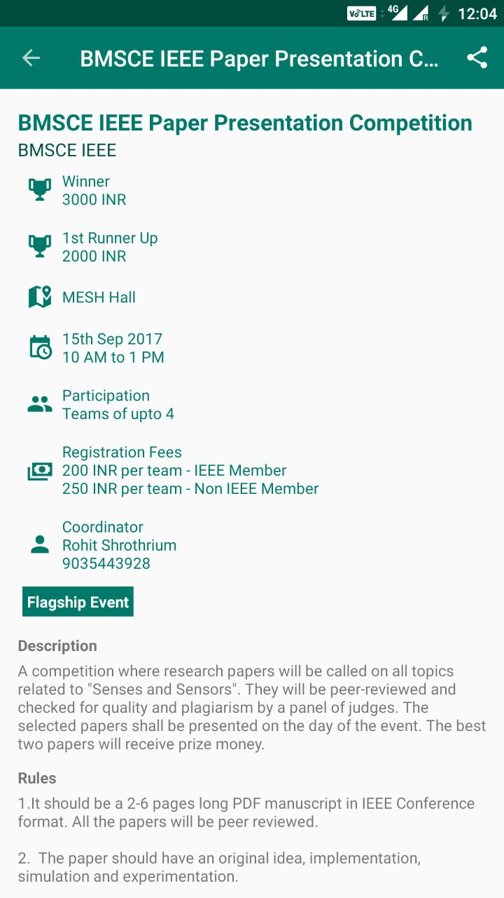
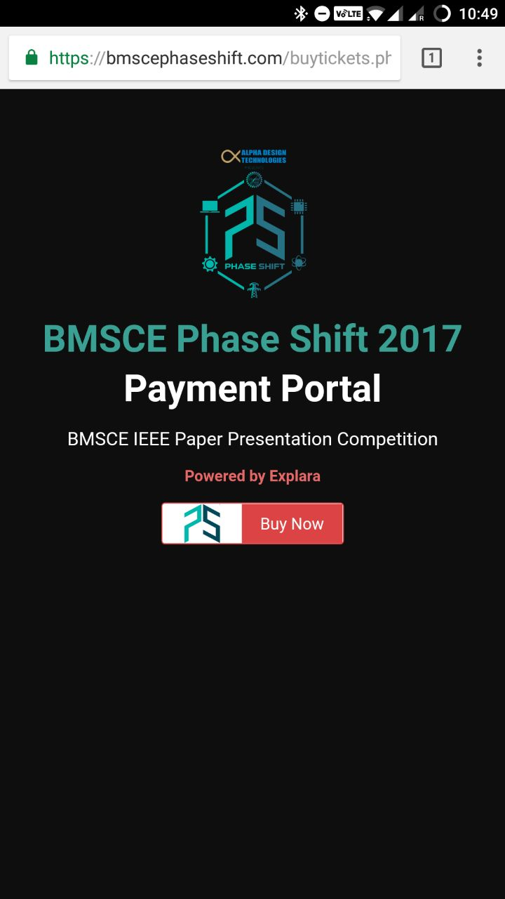
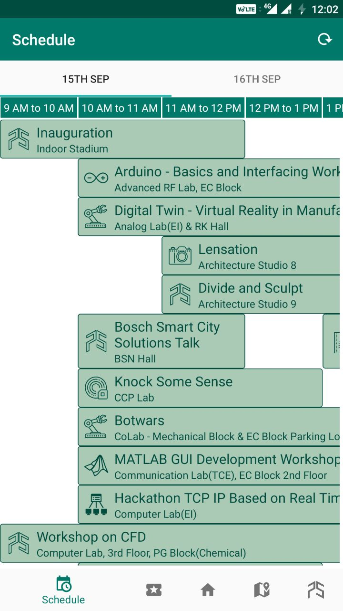
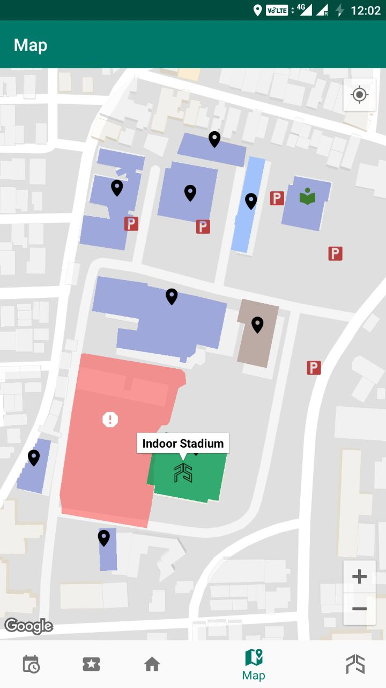
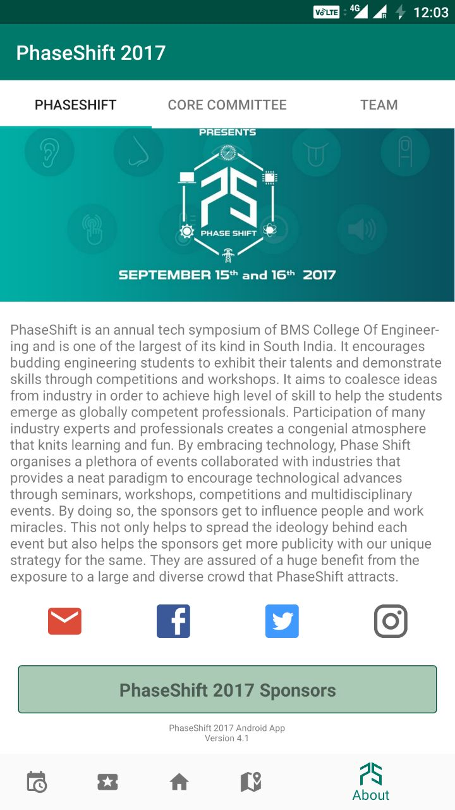
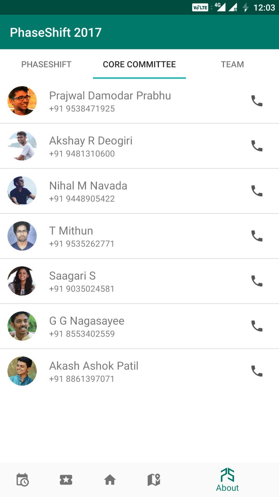

# BMSCE Phase Shift 2017 Official Android App

### Developed by Rahul Kumar, CS Department, BMS College of Engineering

* Online Payment Integration (powered by Explara)
* Quizzes and Crossword (Raspberry Pi Prizes sponsored by Silverline Electronics)
* 2k+ downloads*
* 4.9 Rating*

\* On 16th Sep 2017, 7:00 PM

## PhaseShift

## Feed

## Events
     

## Online Payment Integration
 

## Schedule

## Crossword and Quizzes
  

## Map

## About PhaseShift
   

* [Phase Shift](#phase-shift) Logo and [Phase Shift](#phase-shift) Title are property of [B.M.S. College of Engineering](#bms-college-of-engineering) [Phase Shift](#phase-shift).

### Phase Shift
Phase Shift is the annual tech symposium of BMS College of Engineering and is one of the largest of its kind in South India. It encourages budding engineering students exhibit their talents and demonstrate skills through competitions and workshops. It aims to homogenize ideas from the industry in order to achieve high level of skill and to help students emerge as globally competent professionals. Participation of many industry experts and professionals creates a congenial atmosphere that knits learning and fun. By embracing technology, Phase Shift organizes a plethora of events collaborated with industries that provides a neat paradigm to encourage technological advances through seminars, workshops, competitions and multidisciplinary events. By doing so, the sponsors get to influence people and work miracles. This not only helps spread the ideology behind each event, but also helps sponsors get more publicity with our unique strategy for the same. They are assured a huge benefit from the exposure to a large and diverse crowd that Phase Shift attracts.

### BMS College of Engineering
B.M.S. College of Engineering (BMSCE) is an autonomous engineering college in Basavangudi, Bangalore, India. The college, started in 1946 by B. M. Sreenivasaiah, was the first private sector initiative in technical education in India and is run by the BMS Educational Trust. It was affiliated with Visvesvaraya Technological University from 1998 to 2008, and became autonomous in 2008. BMSCE is located on the Basavangudi Area Bull Temple Road, diagonally opposite to the famous Bull Temple. Though a private engineering college, it is partially funded by the Government of Karnataka
